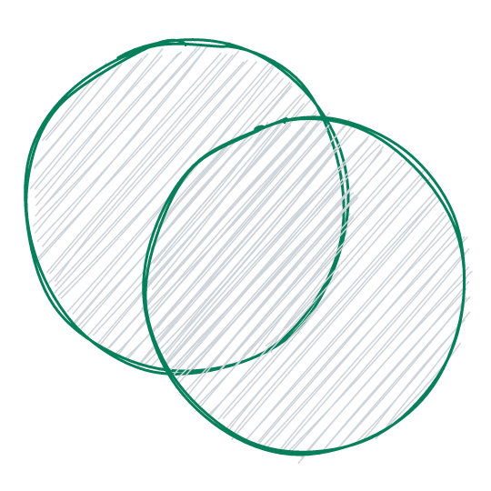

<p align="center">
  
</p>

<h1 align="center">Venn Project</h1>

## Introduction

Venn Project allows members to create communities to collaborate on projects.

[Use it now !](https://expo.dev/@qbaepst/venn-project)

## Contributing

[Yarn](https://classic.yarnpkg.com/en/docs/cli/) is used as package manager.

To setup your local dev environment:

1. Install [Yarn](https://classic.yarnpkg.com/en/docs/install)

2. Clone repository

```sh
git clone git@github.com:quibaritaenperdresatrompe/venn-project.git
cd venn-project
```

3. Install dependencies

```sh
yarn install
```

4. See [more available scripts](README.md#scripts)

## Available Scripts

In the project directory, you can run:

### `start`

Starts local dev server for the app, see [`expo start`](https://docs.expo.dev/workflow/expo-cli/#expo-start).

### `web`

Opens your app in a web browser.

### `android`

Opens your app in Expo Go on a connected Android device.

### `ios`

Opens your app in Expo Go in a currently running iOS simulator on your computer.

### `commit`

Runs the [`git-cz`](https://github.com/streamich/git-cz) CLI to generate commit messages according to the [_Conventional Commit specifications_](https://www.conventionalcommits.org/en/v1.0.0/#specification).

### `format`

Runs [Prettier](https://prettier.io/) with [basic configuration](https://prettier.io/docs/en/configuration.html#basic-configuration).

We recommend to use Prettier in your IDE, e.g. in Visual Studio code with [Prettier - Code formatter](https://marketplace.visualstudio.com/items?itemName=esbenp.prettier-vscode).

### `lint`

Runs [ESLint](https://eslint.org/) with [standard configuration](https://standardjs.com/).

We recommend to use ESLint in your IDE, e.g. in Visual Studio code with [ESLint](https://marketplace.visualstudio.com/items?itemName=dbaeumer.vscode-eslint).
