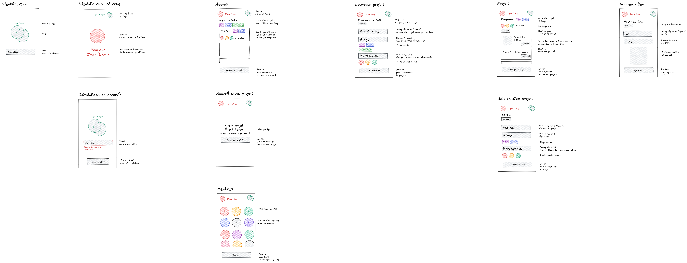

# Devoir

## Introduction

Dans le cadre de la 4ème séance du module **Développement d'application mobile avec React Native** nous allons développer des écrans d'une application nommée **Venn Project**.

## Objectifs

- concevoir des écrans avec Flexbox
- concevoir des composants avec React Native

## Livrables attendus

_à définir_

## Échéance

_à définir_

## Consignes

_à définir_
